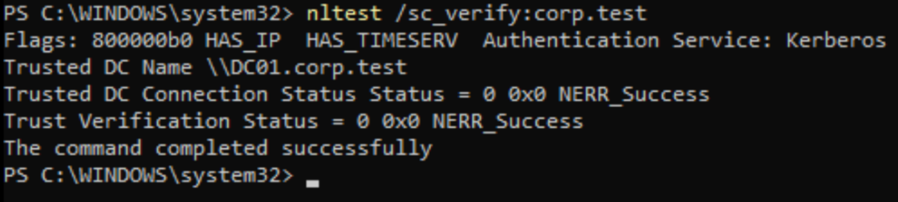
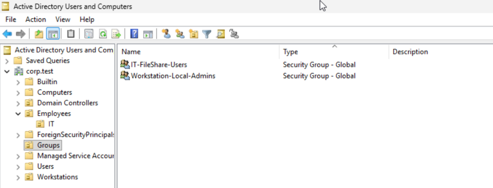
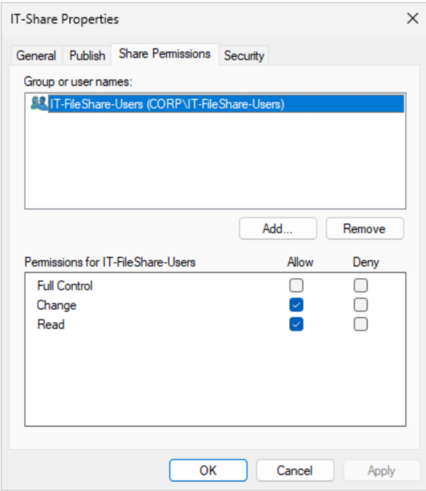
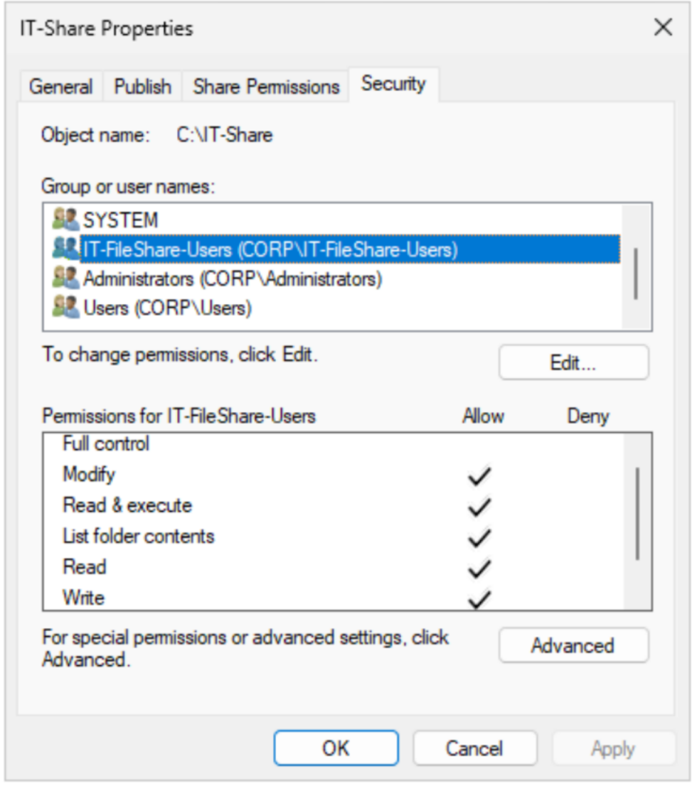
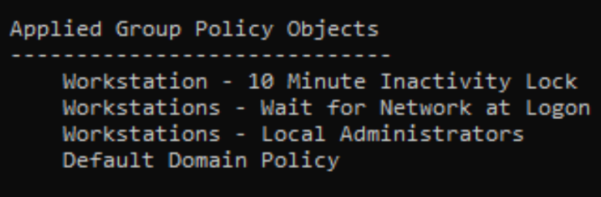
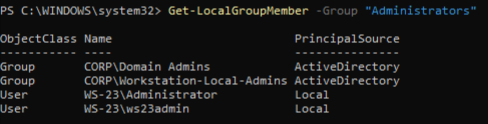
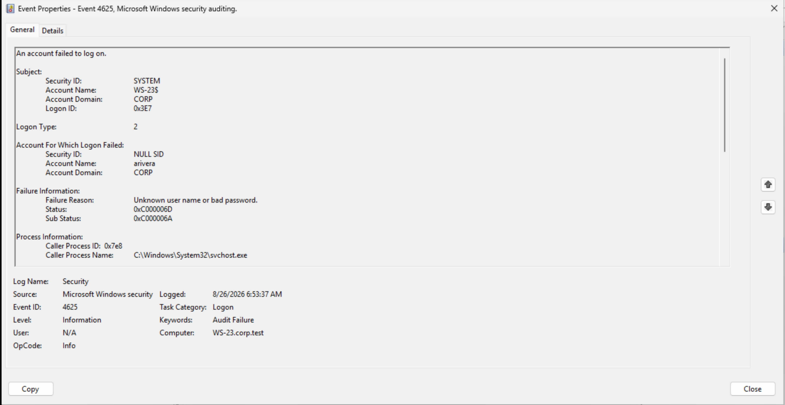
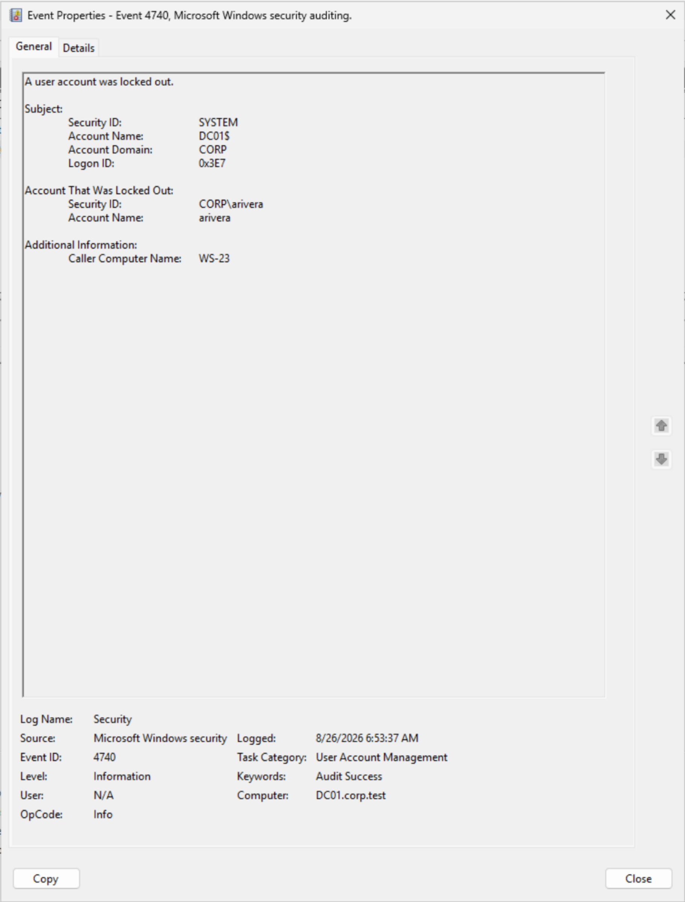
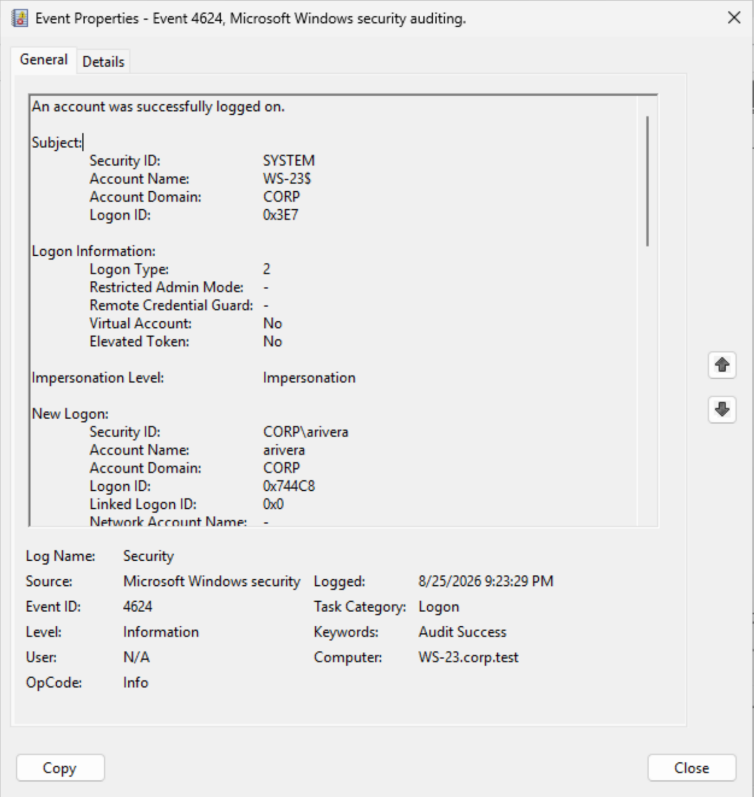
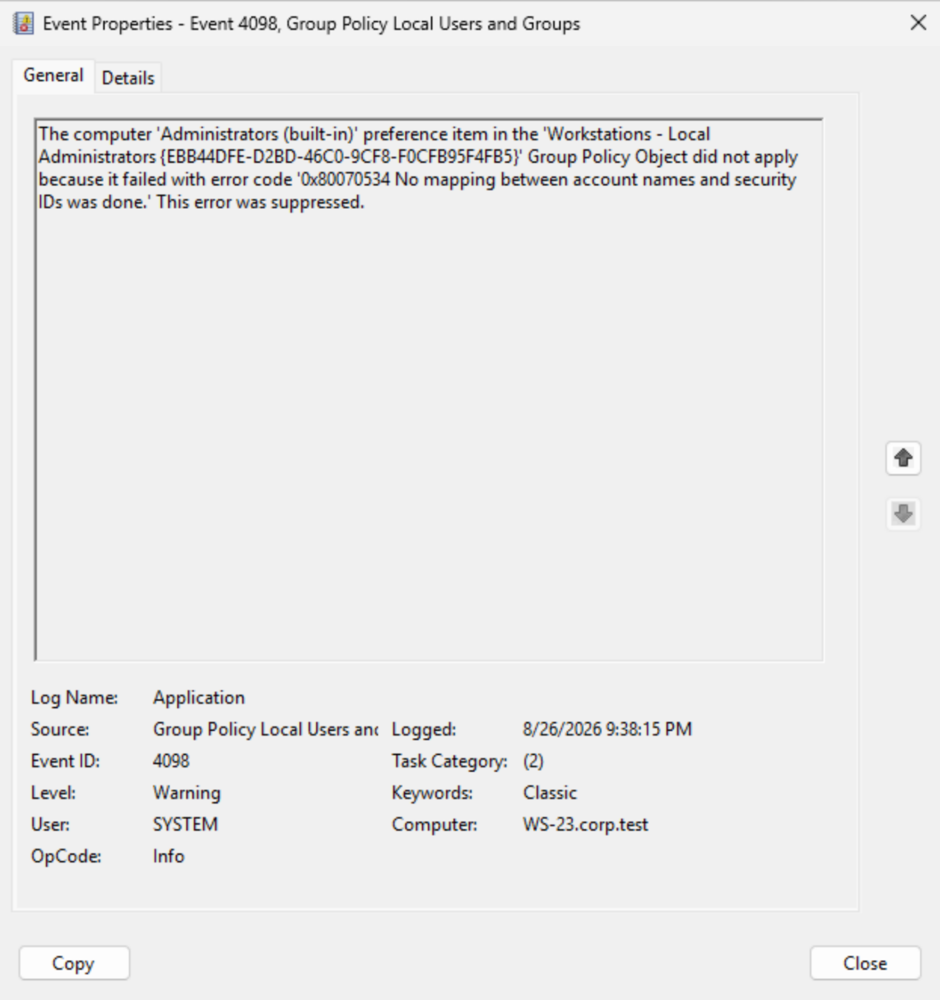

# Active Directory Help Desk Lab

A hands-on home lab I built to practice common Windows help desk and Active Directory administration tasks. Instead of stopping after installing a domain controller, I used the environment to work through user access, Group Policy, file permissions, account lockouts, and several troubleshooting scenarios.

> **Status:** Lab build and initial documentation complete.  
> **Scope:** Isolated home lab using test accounts and test data only.

## Lab Environment

| System | Role | Operating System | IP Address |
|---|---|---|---|
| `DC01` | Domain Controller, DNS, and File Server | Windows Server 2022 | `192.168.122.10` |
| `WS-23` | Domain-joined workstation | Windows 11 | `192.168.122.14` |

- **Domain:** `corp.test`
- **Virtualization:** KVM/libvirt on an Ubuntu host
- **Test user:** `CORP\arivera` (Alex Rivera)

```text
Ubuntu host
└── Isolated virtual network
    ├── DC01 — Active Directory, DNS, Group Policy, and SMB shares
    └── WS-23 — Windows 11 workstation joined to corp.test
```



*I used `nltest` to verify that WS-23 had a healthy secure channel with DC01 and was using Kerberos for authentication.*

## What I Configured

- Installed Active Directory Domain Services and DNS on `DC01` and created the `corp.test` domain.
- Joined `WS-23` to the domain and placed it in a `Workstations` organizational unit.
- Created organizational units, a test user, and security groups for role-based access.
- Configured `WS-23` to use the domain controller as its DNS server.
- Created two SMB shares to test read-only and modify access.
- Applied workstation settings through Group Policy.
- Practiced password-reset and account-unlock workflows.
- Used PowerShell and Event Viewer to verify changes and troubleshoot failures.



*The lab's OU structure and the two security groups used for file-share access and centralized workstation administration.*

## File-Share Access

I created two shares on `DC01` and assigned access through the `IT-FileShare-Users` security group instead of granting permissions directly to the user.

| Share | Share Permission | NTFS Permission | Expected Result |
|---|---|---|---|
| `\\DC01\IT-ReadOnly` | Read | Read & Execute | Open and read files, but not create or delete them |
| `\\DC01\IT-Share` | Change | Modify | Create, edit, rename, and delete files |

This helped me understand that Share and NTFS permissions are evaluated together for network access. If the two layers do not match, the more restrictive permission limits what the user can do.

| SMB Share Permissions | NTFS Permissions |
|---|---|
|  |  |

*The same AD security group receives Change at the share layer and Modify at the NTFS layer.*

## Group Policy

I created and tested the following computer policies for the `Workstations` OU:

- **10-minute inactivity lock** — configured a 600-second machine inactivity limit.
- **Wait for network at logon** — required Windows to wait for the domain network during startup and sign-in.
- **Workstation local administrators** — used Group Policy Preferences to add `CORP\Workstation-Local-Admins` to each workstation's local `Administrators` group.

The local-administrator policy used the **Update** action so the domain group was added without deleting the workstation's existing administrator entries. I left the AD group empty after testing, so the centralized role existed without giving the test user unnecessary administrator rights.



*`gpresult` confirmed that the three workstation policies reached WS-23.*



*The domain group was added to the workstation's local Administrators group while the existing entries were preserved.*

## Help Desk Scenarios

### Password reset

I reset a user's password in Active Directory Users and Computers, issued a temporary password, and required the user to change it at the next sign-in.

### Account lockout

I configured a five-attempt account-lockout threshold with a 10-minute duration and reset window. After intentionally entering the wrong password five times, I used:

- Event `4625` on `WS-23` to confirm failed interactive sign-ins and the bad-password substatus.
- Event `4740` on `DC01` to confirm that `arivera` was locked out and that `WS-23` triggered the lockout.

Because the test user still knew the correct password, I unlocked the account without performing an unnecessary password reset.

**1. Failed sign-in recorded on WS-23**



*Event 4625 recorded an interactive sign-in failure for `arivera`; substatus `0xC000006A` identified an incorrect password.*

**2. Account lockout recorded on DC01**



*Event 4740 confirmed the account lockout and identified WS-23 as the computer that triggered it.*

## Troubleshooting Examples

### Access remained after a group-membership change

When I removed Alex from `IT-FileShare-Users`, access did not immediately change everywhere. I compared several pieces of security state:

```powershell
whoami /groups
klist
Get-SmbSession
```

The investigation showed that Active Directory membership, the user's Windows logon token, Kerberos tickets, and an existing SMB session can refresh at different times. I closed the existing SMB session, refreshed Kerberos tickets, and tested again with a new connection. A full sign-out and sign-in was used when a new local Windows token was required.

The main lesson was to identify which security context is stale before applying a fix.

### Cached domain logon and stale access token

After Alex was removed from `IT-FileShare-Users`, I signed out and back in, but `whoami /groups` still showed the old group SID. Event `4624` on WS-23 showed **Logon Type 11**, meaning Windows had created the interactive session using cached domain credentials.

I enabled **Always wait for the network at computer startup and logon** through a GPO linked to the `Workstations` OU. After applying the policy and restarting WS-23, the next Alex sign-in produced **Logon Type 2** and the local token matched the current AD group membership.

| Before the Policy Change | After the Policy Change |
|---|---|
|  |  |

*The before-and-after events show the change from CachedInteractive to Interactive logon. This gave me a practical example of how a Windows logon session and Kerberos authentication can have separate lifecycles.*

### GPO applied, but its setting failed

`gpresult` showed that the workstation local-administrator GPO had applied, but `CORP\Workstation-Local-Admins` was missing from the local `Administrators` group.

Event Viewer showed Event `4098` with error `0x80070534`: Windows could not map the account name to a SID. The group's pre-Windows 2000 name (`sAMAccountName`) contained a typo. I corrected it, selected the group again so the SID resolved, ran `gpupdate /force`, and verified the result with:



*The GPO reached WS-23, but the individual Local Users and Groups preference failed because Windows could not resolve the group name to a SID.*

```powershell
Get-LocalGroupMember -Group "Administrators"
```

This taught me that a GPO appearing under **Applied Group Policy Objects** does not guarantee that every setting inside it succeeded.

## Validation Commands

| Command | What I Used It For |
|---|---|
| `ipconfig /all` | Confirm workstation IP, gateway, DNS server, and DNS suffix |
| `nltest /dsgetdc:corp.test` | Confirm that `WS-23` could locate the domain controller |
| `nltest /sc_verify:corp.test` | Verify the workstation's secure channel with the domain |
| `whoami /groups` | Inspect group SIDs in the current Windows logon token |
| `klist` | Review cached Kerberos tickets |
| `gpupdate /force` | Request an immediate Group Policy refresh |
| `gpresult /scope computer /r` | Confirm which computer GPOs applied |
| `net accounts /domain` | Review the effective domain account-lockout policy |
| `Get-SmbSession` | Review active SMB sessions on the file server |
| `Get-LocalGroupMember` | Verify local administrator group membership |

## What I Learned

- Active Directory depends on internal DNS so domain clients can locate domain services.
- Authentication confirms identity; authorization determines what that identity can access.
- Creating an AD security group does not grant workstation administrator rights by itself. Group Policy connects that domain role to the workstation's local `Administrators` group.
- Group-membership changes may not immediately replace existing Windows tokens, Kerberos tickets, or SMB sessions.
- `gpresult` verifies GPO delivery, while Event Viewer can reveal a failure inside an individual policy setting.
- Collecting evidence before clearing tickets, closing sessions, or forcing a new logon makes troubleshooting more accurate.

## Project Boundaries

This project was completed in a small, isolated home lab. It demonstrates hands-on practice with Windows domain administration and troubleshooting, but it is not presented as production-environment experience.
